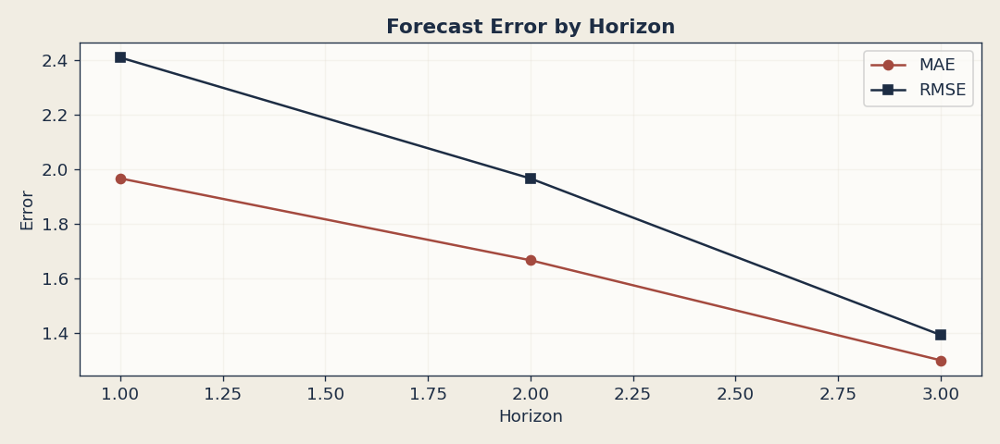
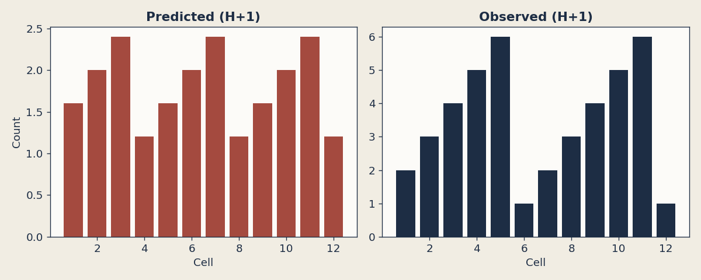

# Forecasts

Forecast artefacts are stored per run under `docs/_static/forecasts/<run_id>/`.

This page tracks how forecasted conflict intensity compares with observed outcomes.
Treat these views as diagnostic and comparative, not operational guidance.

## Demo Run Assets

The report command writes:

- `perf_timeseries.png`
- `map_compare_h1.png`
- `metrics.json`

`perf_timeseries.png` summarizes rolling forecast skill metrics.
`map_compare_h1.png` compares predicted and observed spatial intensity at horizon 1.

```{raw} html
<p></p>
<p></p>
```
