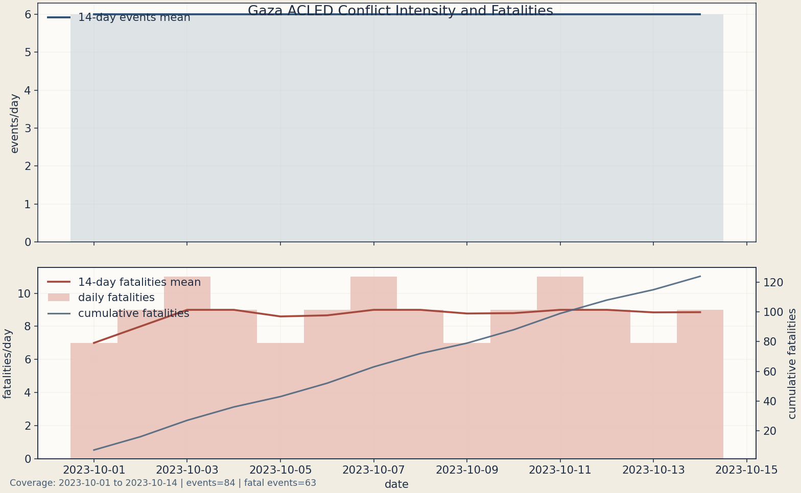
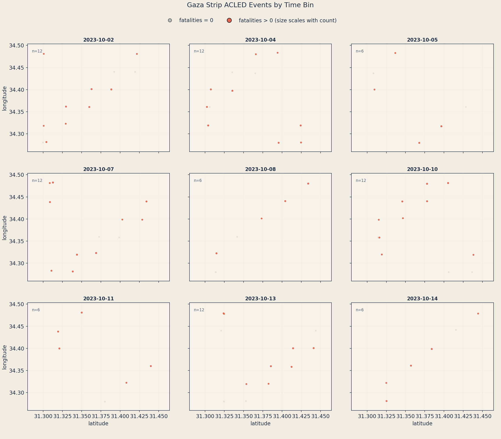

# Gallery

`acled-viz` builds a set of complementary views so spatial pattern, intensity, and temporal change can be read together.

## Hero Points Animation

Points fade out after a configurable trailing window (`--tail-days`), so motion reflects recent conflict activity rather than only cumulative buildup.
Marker size scales with fatalities and color separates `fatalities > 0` from zero-fatality events.

```{raw} html
<video controls muted loop playsinline width="100%">
  <source src="_static/gallery/hero_points.mp4" type="video/mp4" />
</video>
```

## Weekly KDE Animation

This animation shows smoothed spatial density in a trailing window. It is designed to emphasize moving hotspots rather than static point clusters.

```{raw} html
<video controls muted loop playsinline width="100%">
  <source src="_static/gallery/kde_weekly.mp4" type="video/mp4" />
</video>
```

## Summary Counts

Two aligned panels show event intensity and fatalities through time, including rolling means and cumulative fatalities.



## Fatalities Facet Grid

This view bins events across the full cached horizon into evenly spaced time slices,
with point size scaling by fatalities and color separating `fatalities > 0`.



## Interactive Trailing Window Explorer

Use sliders for frame, point lifetime, and playback speed. This widget runs on daily frames across the full cached horizon.

```{raw} html
<iframe src="_static/gallery/points_windowed.html" style="width:100%;height:860px;border:0;border-radius:10px;"></iframe>
```
